# Mapa de Dependências do Sistema (Dependency Map)

> **Status:** `[IMPLEMENTADO]`  
> **Evidências:** `start/main.ts`, `start/jobs.ts`, `providers/app_provider.ts`, `app/modules/*`.

---

## 1. Diagrama de Relacionamento entre Módulos e Infraestrutura

```mermaid
graph TD
    subgraph CoreFoundation ["Núcleo Base (@core)"]
        CoreDomain["@core/domain<br/>(Entity, Result, Either, UseCase, Events)"]
        CorePorts["@core/ports<br/>(Controller, Transaction, Paginate, Search)"]
    end

    subgraph FrameworkShared ["Módulo Compartilhado (#shared)"]
        SharedModels["Lucid Models<br/>(CoreUserModel, CoreRoleModel, CoreStatusModel)"]
        SharedInfra["Infraestrutura<br/>(Outbox/Inbox Models, EmailAdapter, DateAdapter)"]
        SharedJobs["Queue Jobs<br/>(CoreOutboxProcessorJob, CoreSharedInboxProcessor)"]
        EventBus["EventServiceBusImpl<br/>(@adonisjs/core/services/emitter)"]
    end

    subgraph AuthModule ["Módulo de Autenticação (#modules/auth)"]
        AuthDomain["Auth Domain & UseCases<br/>(AuthenticateUser, ResetPassword)"]
        AuthWeb["Inertia Web Controllers<br/>(Login, Logout, Reset Password)"]
        AuthApi["API Rest Controllers<br/>(Token Auth, /api/auth/me)"]
    end

    subgraph AdminModules ["Módulos Administrativos (#modules/admin)"]
        AdminCommon["admin/common<br/>(Profile, Timezones, Notificações)"]
        AdminAudit["admin/audit/log<br/>(MongoDB Extract Logs, View Logs)"]
        AdminRoles["admin/settings/acl/roles_management<br/>(Golden Module: CRUD Roles & Perms)"]
        AdminUsers["admin/settings/acl/users_management<br/>(CRUD Users, Impersonate, Block)"]
        AdminApp["admin/settings/application_management<br/>(App Settings, Cores, Logo)"]
        AdminDash["admin/settings/dashboard_management<br/>(Custom Dashboards & Widgets)"]
    end

    subgraph AddonsModules ["Módulos Addon (#modules/addons)"]
        AddonCRM["addons/crm<br/>(Gestão de Clientes / Empresas)"]
        AddonPedagogy["addons/pedagogy<br/>(Planejado: MED Angola)"]
    end

    subgraph PersistenceLayer ["Camada de Persistência"]
        MySQL[("MySQL 8.x<br/>(Lucid ORM)")]
        MongoDB[("MongoDB<br/>(Logs & Telemetria)")]
        Redis[("Redis 7.x<br/>(BullMQ, Limiter, Lock, WebSockets)")]
    end

    %% Relações do Core
    AuthDomain --> CoreDomain
    AuthWeb --> CorePorts
    AdminRoles --> CoreDomain
    AdminRoles --> CorePorts
    AdminUsers --> CoreDomain
    AdminAudit --> CoreDomain
    AddonCRM --> CoreDomain

    %% Relações com Shared
    AuthDomain --> SharedModels
    AdminCommon --> SharedModels
    AdminRoles --> SharedModels
    AdminUsers --> SharedModels
    AdminApp --> SharedModels
    AdminAudit --> SharedInfra
    AddonCRM --> SharedModels

    %% Persistência
    SharedModels --> MySQL
    AdminAudit --> MongoDB
    SharedJobs --> Redis
    SharedJobs --> EventBus

    %% Comunicação Assíncrona
    AdminCommon -.->|Outbox Event| SharedJobs
    AddonCRM -.->|Outbox Event| SharedJobs
    SharedJobs -.->|Inbox Processor| AdminAudit
    SharedJobs -.->|Inbox Processor| AdminCommon
```

---

## 2. Matriz de Dependência e Consumidores

| Módulo | Tipo | Dependências Diretas Permitidas | Dependências Indiretas (Outbox/Bus) | Consumidores Principais | Risco de Acoplamento |
| :--- | :--- | :--- | :--- | :--- | :--- |
| `@core` | Fundação | Nenhuma | Nenhuma | Todos os módulos | **Nenhum** (Isolado) |
| `shared` | Compartilhado | `@core`, MySQL, MongoDB, Redis | BullMQ, EventEmitter | Todos os módulos | **Médio** (Alterações impactam a todos) |
| `auth` | Core | `@core`, `shared` (UserModel) | Sentry, Limiter | Frontend Web, Apps Mobile/API | **Baixo** |
| `admin/common` | Core | `@core`, `shared` | Outbox -> Notifications, Activities | Dashboard, Layout Geral | **Baixo** |
| `admin/audit/log` | Core | `@core`, `shared`, MongoDB | Inbox -> SaveLogProcessor | Administradores, Segurança | **Baixo** |
| `admin/settings/acl/*` | Core | `@core`, `shared` | Outbox -> RoleCreated/Updated | Gestão de Acessos | **Baixo** |
| `admin/settings/application_management` | Core | `@core`, `shared` | Nenhuma | Shell do Sistema, Tema | **Baixo** |
| `admin/settings/dashboard_management` | Core | `@core`, `shared` | Nenhuma | Dashboard Dinâmico | **Baixo** |
| `addons/crm` | Addon | `@core`, `shared` | Outbox -> Activities | Usuários de Vendas/CRM | **Muito Baixo** (Plugável) |
| `addons/pedagogy` | Addon | `@core`, `shared` | Outbox -> Notificações | Gestão Escolar | **Muito Baixo** (Plugável) |
