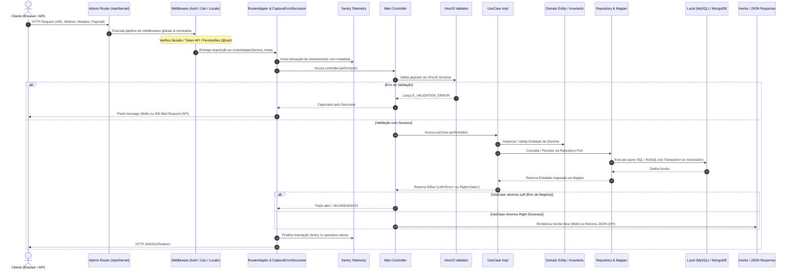

# Visão Geral da Arquitetura (Architecture Overview)

> **Status:** `[IMPLEMENTADO]` com evidências em `@core/`, `app/`, `config/`, `start/`, `providers/`.

---

## 1. Padrão Arquitetural Macro: Monólito Modular

O projeto adota uma arquitetura de **Monólito Modular** guiada por princípios de **Domain-Driven Design (DDD)** e **Clean Architecture (Arquitetura Limpa)** (padrão Portas e Adaptadores / Arquitetura Hexagonal).

### Princípios Fundamentais
1. **Isolamento de Domínio:** Cada módulo encapsula a sua lógica de negócio, entidades, regras de validação invariantes, casos de uso e contratos de infraestrutura.
2. **Independência Tecnológica do Domínio:** A camada de domínio (`domain/`) e a camada de casos de uso (`usecases/`) não possuem dependência de bibliotecas web, controllers ou decorators de framework (com exceção dos utilitários puros de `@core/domain`).
3. **Comunicação Desacoplada:** Os módulos não realizam acoplamento direto ou queries cruzadas em tabelas de outros módulos. A comunicação entre módulos ocorre através de contratos em `shared`, eventos de domínio ou pelo padrão Outbox/Inbox assíncrono.
4. **Bootstrapping Dinâmico:** O framework descobre e registra rotas, listeners de eventos, handlers de websockets, seeders e migrações automaticamente sem necessidade de registro manual centralizado.

---

## 2. Camadas Arquiteturais e Responsabilidades

Cada módulo do sistema (e os módulos dentro de `app/modules/admin/*` e `app/modules/addons/*`) é dividido em 3 camadas concêntricas:

```
                  +-------------------------------------------------------+
                  |                     FRAMEWORK                         |
                  |  +--------------------+       +--------------------+  |
                  |  |       MAIN         |       |       INFRA        |  |
                  |  | Controllers, Routes|       | Models (Lucid/Mongo|  |
                  |  | Factories, DTOs    |       | Repositories Impl  |  |
                  |  | Inertia Views (Vue)|       | Mappers, Adapters  |  |
                  |  | Validators (VineJS)|       | Jobs, Listeners    |  |
                  |  +--------------------+       +--------------------+  |
                  |                           |                           |
                  |                           v                           |
                  |               +-----------------------+               |
                  |               |        USECASES       |               |
                  |               | Orchestration, DTOs   |               |
                  |               | Secondary Ports (repo)|               |
                  |               +-----------------------+               |
                  |                           |                           |
                  |                           v                           |
                  |               +-----------------------+               |
                  |               |        DOMAIN         |               |
                  |               | Entities, Invariants  |               |
                  |               | Value Objects, Events |               |
                  |               | Domain Errors, Types  |               |
                  |               | UseCase Namespace     |               |
                  |               +-----------------------+               |
                  +-------------------------------------------------------+
```

### 2.1. Camada de Domínio (`domain/`)
- **Entidades (`entities/`):** Estendem `Entity<T>` ou `AggregateRoot<T>`. Possuem métodos `static create(props): Either<Error, Entity>` para criação com validação de invariantes e `static hydrate(id, props, options): Entity` para reconstituição da persistência.
- **Value Objects (`value_objects/`):** Estendem `ValueObject<T>`, imutáveis, encapsulam lógica de validação de valores (ex: Email, Cor).
- **Erros de Domínio (`errors/`):** Estendem `Result<DomainError>` ou implementam `DomainError { message, error, payload }`.
- **Eventos de Domínio (`events/`):** Implementam `IDomainEvent<T>`, emitidos quando mutações de estado significativas ocorrem.
- **Contratos de Casos de Uso (`usecases/`):** Definem o namespace do caso de uso contendo `Input`, `Output` (como `Either<Errors, SuccessData>`), `Errors` e a assinatura `Contract = UseCase<Input, Output>`.

### 2.2. Camada de Aplicação / Casos de Uso (`usecases/`)
- **Implementações (`<usecase_name>/<usecase_name>_usecase_impl.ts`):** Orquestram o fluxo de execução.
- **Portas Secundárias (`<usecase_name>/ports/`):** Interfaces TypeScript para Repositórios, Adaptadores externos, Transações (`TransactionAdapter`) e Dispatcher de Eventos (`IEventDispatcher`).
- **Retorno:** Retornam sempre `Promise<Either<Errors, SuccessResult>>` usando as funções `left(...)` ou `right(...)`.

### 2.3. Camada de Framework (`framework/`)
Subdividida em duas subcamadas:
- **`framework/infra/`:**
  - **`db/models/`:** Models Lucid ORM (MySQL) ou Schemas de Coleção MongoDB.
  - **`db/mappers/`:** Classes `Mapper<DomainEntity, LucidModel>` implementando `toDomain()` e `toPersistence()`.
  - **`db/repositories/`:** Implementações dos repositórios que utilizam os models Lucid/MongoDB e convertem dados através de mappers.
  - **`db/migrations/` e `db/seeders/`:** Migrações e seeds isoladas por módulo.
  - **`jobs/`:** Handlers de filas processadas pelo BullMQ (`@acidiney/bull-queue`).
  - **`listeners/`:** Escutadores de eventos de mensageria assíncrona ou eventos locais.
- **`framework/main/`:**
  - **`controllers/`:** Controllers AdonisJS implementando a interface `Controller<HttpContext>`.
  - **`factories/`:** Funções fábricas (ex: `makeCreateRoleControllerFactory()`) que instanciam e injetam manualmente repositórios, mappers, transações e usecases.
  - **`routes.ts`:** Definição das rotas HTTP, protegidas por `routeAdapter(factory(), meta)` e middlewares de autenticação/autorização (`middleware.can(...)`).
  - **`validators/`:** Schemas de validação construídos com VineJS (`@vinejs/vine`).
  - **`i18n/`:** Arquivos `.json` ou `.yaml` de tradução internacionalizados por idioma (`pt`, `en`).
- **`framework/views/`:** Componentes de interface Vue.js 3 renderizados como Single Page Application através do Inertia.js (`@inertiajs/vue3`).

---

## 3. O Núcleo do Boilerplate: Pacote `@core`

Localizado na raiz em `@core/`, fornece as primitivas compartilhadas entre todos os módulos:

| Arquivo / Diretório | Propósito | Implementação Real |
| :--- | :--- | :--- |
| `@core/domain/entity.ts` | Classe abstrata base `Entity<T>` com gestão de ID, `createdAt`, `updatedAt`, `deletedAt` (soft delete) | `[IMPLEMENTADO]` |
| `@core/domain/aggregate_root.ts` | Extensão de `Entity<T>` com fila interna de eventos de domínio `addDomainEvent()` e `clearEvents()` | `[IMPLEMENTADO]` |
| `@core/domain/unique_entity_id.ts` | Identificador único UUID v4 (`randomUUID()` nativo) encapsulado em `Identifier` | `[IMPLEMENTADO]` |
| `@core/domain/either.ts` | Mônada funcional de tratamento de resultados `Either<L, A>`, `Left<L, A>`, `Right<L, A>`, funções `left()` e `right()` | `[IMPLEMENTADO]` |
| `@core/domain/result.ts` | Encapsulamento de status de sucesso/falha de operações de domínio com `Result.ok()` e `Result.fail()` | `[IMPLEMENTADO]` |
| `@core/domain/value_object.ts` | Classe base imutável `ValueObject<T>` | `[IMPLEMENTADO]` |
| `@core/domain/use_case.ts` | Interfaces `UseCase<I, O>` e `UseCaseWithoutInput<O>` com método `perform()` | `[IMPLEMENTADO]` |
| `@core/domain/mapper.ts` | Contrato abstrato `Mapper<Domain, Persistence>` com métodos `toDomain` e `toPersistence` | `[IMPLEMENTADO]` |
| `@core/domain/events/` | `EventDispatcher`, `IDomainEvent`, `IHandler`, `IEventDispatcher` para publicação síncrona/assíncrona in-memory | `[IMPLEMENTADO]` |
| `@core/ports/controller.ts` | Interface universal `Controller<I>` com método `perform(input: I)` | `[IMPLEMENTADO]` |
| `@core/ports/transaction_adapter.ts` | Interface `TransactionAdapter` com método `useTransaction(callback)` | `[IMPLEMENTADO]` |
| `@core/ports/pagination.ts` | Tipos estruturados de paginação `Paginate`, `Pagination<T>`, `Data<T>` | `[IMPLEMENTADO]` |
| `@core/ports/search.ts` | Tipos estruturados de filtros e ordenação `Search`, `Operator` (LIKE, EQ, NEQ, GTE, LTE) | `[IMPLEMENTADO]` |

---

## 4. Ciclo de Requisição HTTP (Request Lifecycle)



---

## 5. Estratégia de Persistência Dual: MySQL + MongoDB

O boilerplate opera com persistência híbrida especializada:

1. **MySQL 8.x (Lucid ORM):**
   - Base de dados primária relacional e transacional.
   - Tabelas com prefixo identificador do módulo (ex: `core_users`, `core_roles`, `core_outbox_messages`).
   - Suporte completo a transações ACID via `TransactionAdapterImpl` (`trx.forUpdate().skipLocked()`).
2. **MongoDB (MongoClient nativo):**
   - Armazenamento não estruturado de alta performance para auditoria e telemetria:
     - `CoreUserActivities`: Rastreamento de ações, IPs, sessões e operações por usuário.
     - `CoreNotifications`: Eventos de notificação em tempo real persistidos.
   - Inicialização e criação de índices automáticos no boot da aplicação (`providers/app_provider.ts`).

---

## 6. Comunicação Assíncrona: Padrão Outbox & Inbox

Para garantir desacoplamento total e consistência eventual entre módulos:

1. **Outbox (`core_outbox_messages`):** Quando um módulo executa uma operação que outros módulos precisam saber, insere um registro na tabela `core_outbox_messages` dentro da mesma transação do banco de dados.
2. **Outbox Processor Job (`CoreOutboxProcessorJob`):** O job periódico lê registros com `sentAt IS NULL` usando `forUpdate().skipLocked()`, despacha a mensagem através do `MessageBus` e marca a data de envio.
3. **MessageBus Real (`EventServiceBusImpl`):** `[EVIDÊNCIA REAL]` Emite eventos via `@adonisjs/core/services/emitter` com prefixo `outbox_exchange:<routingKey>`.
4. **Inbox (`core_inbox_messages`):** Módulos assinantes recebem o evento e inserem uma mensagem na sua tabela Inbox para processamento garantido.
5. **Inbox Processor Job (`CoreSharedInboxProcessor`):** Processa os contratos de mensageria registrados (envio de emails, notificações, logs, tracking) de forma assíncrona com controle de retry e DLQ pelo BullMQ.
