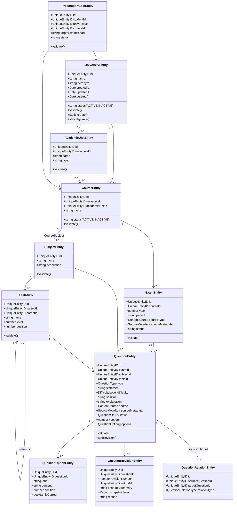

# Plano Técnico de Implementação — Módulo 01: Estrutura Académica, Exames e Conteúdo de Avaliação

> **Status:** `[OFICIAL / PRONTO PARA EXECUÇÃO]`  
> **Data:** 2026-08-28  
> **Módulo:** `app/modules/addons/academic`  
> **Documento de Requisitos de Origem:** [`docs/modules/module-01-master-prompt.md`](file:///c:/Users/MP/Documents/app-invoice-sas/boilerPlate/docs/modules/module-01-master-prompt.md)  
> **Padrão Arquitetural:** Monólito Modular — Clean Architecture + DDD + Golden Module ([`docs/architecture/golden-module.md`](file:///c:/Users/MP/Documents/app-invoice-sas/boilerPlate/docs/architecture/golden-module.md))

---

## 1. Visão Geral e Fronteira do Módulo (Bounded Context)

O Módulo 01 (`academic`) encapsula todas as regras de negócio relativas à:
1. **Estrutura Curricular e Institucional:** Universidades, Unidades Acadêmicas, Cursos, Disciplinas e Tópicos hierárquicos em árvore.
2. **Avaliação e Conteúdo de Provas:** Exames oficiais independentes por curso/ano, Questões (com alternativas, soluções analíticas, explicações pedagógicas), Relações entre questões (`SAME_AS`, `SIMILAR_TO`) e Versionamento de revisões (`QuestionRevision`).
3. **Objetivos de Preparação do Estudante:** Metas de estudo multi-universidade (`PreparationGoal`), rastreamento de domínio por tópico (*Knowledge*) vs nível de prontidão para exames (*Preparation*).
4. **Segurança, Moderação e Auditoria:** Pipeline de transição de estados (`DRAFT -> PROCESSING -> AI_PROCESSED -> UNDER_REVIEW -> APPROVED -> PUBLISHED / REJECTED / ARCHIVED`), controle de concorrência otimista (`version`), proteção estrita contra IDOR e trilha de auditoria completa no MongoDB.

---

## 2. Diagrama de Relacionamentos e Entidades de Domínio



---

## 3. Estrutura Canônica de Diretórios (`app/modules/addons/academic`)

Seguindo rigorosamente o padrão do Golden Module:

```text
app/modules/addons/academic/
├── domain/
│   ├── entities/
│   │   ├── university_entity.ts
│   │   ├── academic_unit_entity.ts
│   │   ├── course_entity.ts
│   │   ├── subject_entity.ts
│   │   ├── topic_entity.ts
│   │   ├── exam_entity.ts
│   │   ├── question_entity.ts
│   │   ├── question_option_entity.ts
│   │   ├── question_revision_entity.ts
│   │   ├── question_relation_entity.ts
│   │   ├── preparation_goal_entity.ts
│   │   └── index.ts
│   ├── value_objects/
│   │   ├── question_type.ts
│   │   ├── question_status.ts
│   │   ├── difficulty_level.ts
│   │   ├── content_source.ts
│   │   ├── source_metadata.ts
│   │   ├── question_relation_type.ts
│   │   └── index.ts
│   ├── errors/
│   │   ├── university_errors.ts
│   │   ├── course_errors.ts
│   │   ├── subject_topic_errors.ts
│   │   ├── exam_errors.ts
│   │   ├── question_errors.ts
│   │   ├── preparation_goal_errors.ts
│   │   └── index.ts
│   ├── events/
│   │   ├── university_events.ts
│   │   ├── exam_events.ts
│   │   ├── question_events.ts
│   │   ├── preparation_goal_events.ts
│   │   └── index.ts
│   ├── usecases/
│   │   ├── university/
│   │   ├── course/
│   │   ├── subject_topic/
│   │   ├── exam/
│   │   ├── question/
│   │   └── preparation_goal/
│   └── index.ts
│
├── usecases/
│   ├── university/
│   │   ├── create_university/
│   │   ├── update_university/
│   │   ├── toggle_university_status/
│   │   ├── list_universities/
│   │   └── find_university/
│   ├── course/
│   │   ├── create_course/
│   │   ├── update_course/
│   │   ├── toggle_course_status/
│   │   └── list_courses_by_university/
│   ├── subject_topic/
│   │   ├── create_subject/
│   │   ├── attach_subject_to_course/
│   │   ├── create_topic/
│   │   └── get_topic_hierarchy/
│   ├── exam/
│   │   ├── create_exam/
│   │   ├── update_exam/
│   │   ├── publish_exam/
│   │   └── list_exams_by_course/
│   ├── question/
│   │   ├── create_question/
│   │   ├── update_question/
│   │   ├── change_question_status/
│   │   ├── get_question_details/
│   │   ├── list_published_questions/
│   │   └── relate_questions/
│   └── preparation_goal/
│       ├── create_preparation_goal/
│       ├── list_student_goals/
│       └── archive_preparation_goal/
│
├── framework/
│   ├── infra/
│   │   ├── db/
│   │   │   ├── migrations/
│   │   │   │   ├── 1724850000001_create_acad_universities_table.ts
│   │   │   │   ├── 1724850000002_create_acad_academic_units_table.ts
│   │   │   │   ├── 1724850000003_create_acad_courses_table.ts
│   │   │   │   ├── 1724850000004_create_acad_subjects_table.ts
│   │   │   │   ├── 1724850000005_create_acad_course_subjects_table.ts
│   │   │   │   ├── 1724850000006_create_acad_topics_table.ts
│   │   │   │   ├── 1724850000007_create_eval_exams_table.ts
│   │   │   │   ├── 1724850000008_create_eval_questions_table.ts
│   │   │   │   ├── 1724850000009_create_eval_question_options_table.ts
│   │   │   │   ├── 1724850000010_create_eval_question_revisions_table.ts
│   │   │   │   ├── 1724850000011_create_eval_question_relations_table.ts
│   │   │   │   └── 1724850000012_create_student_preparation_goals_table.ts
│   │   │   ├── models/
│   │   │   ├── mappers/
│   │   │   ├── repositories/
│   │   │   └── seeders/
│   │   ├── jobs/
│   │   └── listeners/
│   ├── main/
│   │   ├── controllers/
│   │   ├── factories/
│   │   ├── validators/
│   │   ├── i18n/
│   │   │   ├── pt.json
│   │   │   └── en.json
│   │   ├── routes.ts
│   │   ├── events.ts
│   │   └── startup.ts
│   └── views/
```

---

## 4. Esquema de Banco de Dados (MySQL + MongoDB)

### 4.1. Tabelas MySQL (com UUID v4 e Soft Delete)

1. **`acad_universities`:**
   - `id VARCHAR(36) PRIMARY KEY`
   - `name VARCHAR(255) NOT NULL UNIQUE`
   - `acronym VARCHAR(50) NOT NULL`
   - `status ENUM('ACTIVE', 'INACTIVE') DEFAULT 'ACTIVE'`
   - `created_at DATETIME`, `updated_at DATETIME`, `deleted_at DATETIME NULL`

2. **`acad_academic_units`:**
   - `id VARCHAR(36) PRIMARY KEY`
   - `university_id VARCHAR(36) NOT NULL (FK acad_universities)`
   - `name VARCHAR(255) NOT NULL`
   - `type VARCHAR(100) NOT NULL` (Faculdade, Instituto, Departamento, etc.)
   - `created_at DATETIME`, `updated_at DATETIME`, `deleted_at DATETIME NULL`

3. **`acad_courses`:**
   - `id VARCHAR(36) PRIMARY KEY`
   - `university_id VARCHAR(36) NOT NULL (FK acad_universities)`
   - `academic_unit_id VARCHAR(36) NULL (FK acad_academic_units)`
   - `name VARCHAR(255) NOT NULL`
   - `status ENUM('ACTIVE', 'INACTIVE') DEFAULT 'ACTIVE'`
   - `created_at DATETIME`, `updated_at DATETIME`, `deleted_at DATETIME NULL`
   - `UNIQUE(university_id, name)`

4. **`acad_subjects`:**
   - `id VARCHAR(36) PRIMARY KEY`
   - `name VARCHAR(255) NOT NULL UNIQUE`
   - `description TEXT NULL`
   - `created_at DATETIME`, `updated_at DATETIME`, `deleted_at DATETIME NULL`

5. **`acad_course_subjects`:**
   - `id VARCHAR(36) PRIMARY KEY`
   - `course_id VARCHAR(36) NOT NULL (FK acad_courses)`
   - `subject_id VARCHAR(36) NOT NULL (FK acad_subjects)`
   - `UNIQUE(course_id, subject_id)`

6. **`acad_topics`:**
   - `id VARCHAR(36) PRIMARY KEY`
   - `subject_id VARCHAR(36) NOT NULL (FK acad_subjects)`
   - `parent_id VARCHAR(36) NULL (FK acad_topics)`
   - `name VARCHAR(255) NOT NULL`
   - `level INT DEFAULT 1`
   - `position INT DEFAULT 0`
   - `created_at DATETIME`, `updated_at DATETIME`, `deleted_at DATETIME NULL`

7. **`eval_exams`:**
   - `id VARCHAR(36) PRIMARY KEY`
   - `course_id VARCHAR(36) NOT NULL (FK acad_courses)`
   - `year INT NOT NULL`
   - `period VARCHAR(50) NOT NULL` (ex: 'Fase Regular', 'Chamada Especial')
   - `source_type VARCHAR(50) NOT NULL` (`OFFICIAL_EXAM`, `PREPARATORY_MATERIAL`, etc.)
   - `source_metadata JSON NULL`
   - `document_url VARCHAR(500) NULL` (Path privado no storage)
   - `status VARCHAR(50) DEFAULT 'DRAFT'`
   - `created_at DATETIME`, `updated_at DATETIME`, `deleted_at DATETIME NULL`
   - `UNIQUE(course_id, year, period)`

8. **`eval_questions`:**
   - `id VARCHAR(36) PRIMARY KEY`
   - `exam_id VARCHAR(36) NULL (FK eval_exams)`
   - `subject_id VARCHAR(36) NOT NULL (FK acad_subjects)`
   - `topic_id VARCHAR(36) NOT NULL (FK acad_topics)`
   - `type VARCHAR(50) NOT NULL` (`SINGLE_CHOICE`, `MULTIPLE_CHOICE`, etc.)
   - `statement TEXT NOT NULL` (Suporte a LaTeX/Markdown)
   - `difficulty VARCHAR(50) NOT NULL` (`VERY_EASY`, `EASY`, `MEDIUM`, `HARD`, `VERY_HARD`)
   - `solution LONGTEXT NULL` (Processo passo a passo)
   - `explanation LONGTEXT NULL` (Explicação pedagógica didática)
   - `source VARCHAR(50) NOT NULL`
   - `source_metadata JSON NULL`
   - `status VARCHAR(50) DEFAULT 'DRAFT'`
   - `version INT DEFAULT 1` (Optimistic Locking)
   - `created_at DATETIME`, `updated_at DATETIME`, `deleted_at DATETIME NULL`
   - `INDEX(status, subject_id, topic_id)`

9. **`eval_question_options`:**
   - `id VARCHAR(36) PRIMARY KEY`
   - `question_id VARCHAR(36) NOT NULL (FK eval_questions)`
   - `label VARCHAR(10) NOT NULL` (A, B, C, D, E)
   - `content TEXT NOT NULL`
   - `position INT NOT NULL`
   - `is_correct BOOLEAN NOT NULL DEFAULT FALSE`
   - `created_at DATETIME`, `updated_at DATETIME`
   - `UNIQUE(question_id, label)`

10. **`eval_question_revisions`:**
    - `id VARCHAR(36) PRIMARY KEY`
    - `question_id VARCHAR(36) NOT NULL (FK eval_questions)`
    - `revision_number INT NOT NULL`
    - `author_id VARCHAR(36) NOT NULL (FK core_users)`
    - `changes_summary TEXT NOT NULL`
    - `snapshot_data JSON NOT NULL`
    - `reason VARCHAR(255) NOT NULL`
    - `created_at DATETIME`

11. **`eval_question_relations`:**
    - `id VARCHAR(36) PRIMARY KEY`
    - `source_question_id VARCHAR(36) NOT NULL (FK eval_questions)`
    - `target_question_id VARCHAR(36) NOT NULL (FK eval_questions)`
    - `relation_type ENUM('SAME_AS', 'SIMILAR_TO') NOT NULL`
    - `created_at DATETIME`
    - `UNIQUE(source_question_id, target_question_id)`

12. **`student_preparation_goals`:**
    - `id VARCHAR(36) PRIMARY KEY`
    - `student_id VARCHAR(36) NOT NULL (FK core_users)`
    - `university_id VARCHAR(36) NOT NULL (FK acad_universities)`
    - `course_id VARCHAR(36) NOT NULL (FK acad_courses)`
    - `target_exam_period VARCHAR(50) NULL`
    - `status ENUM('ACTIVE', 'ARCHIVED') DEFAULT 'ACTIVE'`
    - `created_at DATETIME`, `updated_at DATETIME`, `deleted_at DATETIME NULL`
    - `INDEX(student_id, status)`

### 4.2. Coleções MongoDB
- **`AuditLogs`:** Rastreamento imutável de transições de status (`APPROVE_QUESTION`, `PUBLISH_QUESTION`, etc.), contendo `actor_id`, `ip`, `userAgent`, `diff` e `timestamp`.
- **`AIExtractionLogs`:** Rastreamento do payload bruto extraído de PDFs, tokens utilizados, confiança do modelo e instruções de sanitização aplicadas.

---

## 5. Fases Sequenciais de Implementação

| Fase | Escopo | Artefatos Produzidos |
| :--- | :--- | :--- |
| **Fase 1: Registro & Docs** | Registro do módulo e documentação canônica | `docs/modules/academic.md`, `docs/modules/module-registry.md` |
| **Fase 2: Domínio Puro (`domain/`)** | Entidades, Value Objects, Domain Errors, Events e Contratos de Casos de Uso | `domain/entities/*`, `domain/value_objects/*`, `domain/errors/*`, `domain/usecases/*` |
| **Fase 3: Casos de Uso & Testes (`usecases/`)** | Implementação dos casos de uso, interfaces em `ports/` e testes unitários 100% isolados com Sinon stubs | `usecases/*/*_usecase_impl.ts`, `usecases/*/*_usecase_impl.spec.ts` |
| **Fase 4: Persistência (`framework/infra/`)** | Migrations MySQL, Lucid Models, Mappers bidirecionais, Repositories com transações | `framework/infra/db/migrations/*`, `framework/infra/db/models/*`, `framework/infra/db/mappers/*`, `framework/infra/db/repositories/*` |
| **Fase 5: HTTP & Rotas (`framework/main/`)** | Validadores VineJS, Controllers adaptados, Factories de injeção, Rotas com `routeAdapter`, Dicionários i18n | `framework/main/validators/*`, `framework/main/controllers/*`, `framework/main/factories/*`, `framework/main/routes.ts`, `framework/main/i18n/*` |
| **Fase 6: Verificação Completa** | Execução de testes unitários, checagem de tipos TypeScript e Lint | `node ace test --suite=unit`, `npm run typecheck`, `npm run lint` |
| **Fase 7: Finalização & Registry** | Atualização do status para `IMPLEMENTED` | `docs/modules/module-registry.md` |
